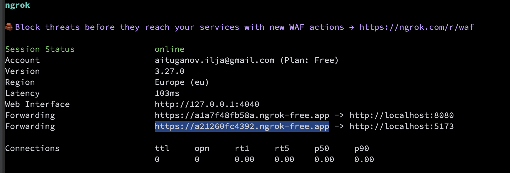

# Light Hunter — Multiplayer Browser Game

## Table of Contents

1. [Introduction](#introduction)
2. [Game Description](#game-description)

    * [Bonuses](#bonuses)
    * [Abilities](#abilities)
    * [Win Conditions](#win-conditions)
3. [Controls](#controls)
4. [Technical Details](#technical-details)

    * [Architecture](#architecture)
    * [Libraries and Dependencies](#libraries-and-dependencies)
    * [Python Install (Only for single Mode)](#python-setup-for-bots-single-player-mode)
         * [Windows](#windows-setup)
         * [Linux](#linux-setup-debianubuntu)
         * [MacOs](#macos-setup)
5. [Running the Project](#running-the-project)
6. [Configure ngrok](#configure-ngrok)
7. [Single player Mode](#single-player-mode-npc)

   * [Description](#description)
   * [Functional Features](#functional-features)
   * [Virtual Opponents](#virtual-opponents-npc)
   * [Difficulty Levels](#difficulty-levels)
   * [Bot Customization](#bot-customization)
   * [Bot Limitations](#bot-limitationst)
   * [System Interaction](#system-interaction)

---

## Introduction

This project was developed as part of an assignment: to create a multiplayer web game that works **in the browser without Canvas**, using only DOM elements.
The game must support **2 to 4 players**, ensure smooth animation (60 FPS with `requestAnimationFrame`), and work over the internet, not just on a local network.

A new game mode has been added — **Single Player**, which allows starting the game without connecting other players.  
In this mode, the player competes against **computer-controlled opponents (bots)**, making it possible to play even without internet access or friends online.

---

## Game Description

The game is essentially a **hide-and-seek in a maze**.

* The map consists of walls forming corridors and dead ends.
* Each player has a **flashlight** that illuminates their path.
* Players are divided into roles:

    * **Seeker** — must find all Hiders within the time limit.
    * **Hiders** — must avoid being found.
    * **Spectator** - when a hider is found, they become a spectator and can freely move around the map through obstacles.

### Bonuses

Bonuses appear on the map:

1. **Speed** — temporarily increases the player's movement speed.
2. **Time** — adds time to the global timer for the Seeker, and subtracts time for the Hiders.
3. **Vision** - opens the map for a limited time.

### Abilities

* A Hider can press **Ctrl** to "hide in darkness": their flashlight turns off, making them invisible.

### Win Conditions

* **Seeker wins** if all Hiders are caught before the timer runs out.
* **Hiders win** if at least one survives until the timer expires.

---

## Controls

| Key       | Action                   |
| --------- | ------------------------ |
| **W / ↑** | Move forward             |
| **S / ↓** | Move backward            |
| **A / ←** | Rotate left              |
| **D / →** | Rotate right             |
| **Space** | Pause / Resume           |
| **Ctrl**  | Toggle flashlight on/off |

---

## Technical Details

### Architecture

* **Frontend** — Vite, Vanilla JS, DOM rendering (no Canvas).
* **Backend** — Node.js, Express, Socket.IO for real-time player synchronization.
* Communication happens via WebSocket events (`player:move`, `bonus:pickup`, `game:pause`, `timer:tick`, etc.).

### Libraries and Dependencies

#### Backend (`/backend`)

**Dependencies**

* **express** `^5.1.0` — HTTP server.
* **socket.io** `^4.8.1` — real-time multiplayer communication.
* **cors** `^2.8.5` — CORS support for the frontend.
* **dotenv** `^17.2.1` — environment variables management.

**Dev Dependencies**

* **nodemon** `^3.1.10` — auto-restart server on changes.

#### Frontend (`/frontend`)

**Dependencies**

* **vite** `^7.0.4` — bundler and dev server (listed under devDependencies, used during development/build).
* **socket.io-client** `^4.8.1` — client connection to the server.
* **socket.io** `^4.8.1` — shared protocol utilities used by some builds (optional; client uses `socket.io-client`).
* **howler** `^2.2.4` — audio playback for sound effects.

**Dev Dependencies**

* **vite** `^7.0.4`

---

###  Python Setup for Bots (Single Player Mode)

The **bot logic** in Single Player mode requires Python 3.10+ and several packages.
Follow the instructions below to install Python and the required dependencies on **Windows, Linux, or macOS**.

---

## Windows Setup

1. **Install Python**

   * Download the latest Python installer: [python.org/downloads/windows](https://www.python.org/downloads/windows/)
   * During installation, check **“Add Python to PATH”**.

2. **Verify installation**

   ```powershell
   python --version
   pip --version
   ```

3. **Install dependencies**

   ```powershell
   pip install websocket-client python-socketio requests
   ```

---

## Linux Setup (Debian/Ubuntu)

1. **Install Python and pip**

   ```bash
   sudo apt update
   sudo apt install -y python3 python3-pip
   ```

2. **Verify installation**

   ```bash
   python3 --version
   pip3 --version
   ```

3. **Install dependencies**

   ```bash
   pip3 install websocket-client python-socketio requests
   ```

**On Fedora:**

```bash
sudo dnf install -y python3 python3-pip
```

**On Arch Linux:**

```bash
sudo pacman -S python python-pip
```

---

## macOS Setup

### Option A — via Homebrew (recommended)

1. **Install Homebrew** (if not installed): [brew.sh](https://brew.sh)

2. **Install Python**

   ```bash
   brew install python@3.11
   ```

3. **Verify installation**

   ```bash
   python3 --version
   pip3 --version
   ```

4. **Install dependencies**

   ```bash
   pip3 install websocket-client python-socketio requests
   ```
---

## Running the Project

1. Clone the repository:

   ```bash
   git clone <https://gitea.kood.tech/iljaaituganov/web-game.git>
   cd <repo-folder>
   ```

2. Install dependencies:

   ```bash
   cd backend
   npm install
   cd ../frontend
   npm install
   ```

3. Start the backend:

   ```bash
   cd backend
   npm run dev
   ```

4. Start the frontend:

   ```bash
   cd frontend
   npm run dev
   ```

5.  Once started:

    * Open the frontend URL (usually `http://localhost:5173`).
    * Enter a player name and join the lobby.
    * Once all players are ready, the **host** starts the game.

## Configure ngrok

 - Add Your Authtoken

    Open your terminal and run:

    ```yaml
    ngrok config add-authtoken <your_token>
    ```

 - Edit the Configuration File

    Open the ngrok configuration file by running:

    ```yaml
    ngrok config edit
    ```

 - Then add the following configuration (your authtoken will already be present):

    ```yaml
    version: "3"
    
    agent:
      authtoken: <your_token>
    
    endpoints:
      - name: frontend
        upstream:
          url: http://localhost:5173
      - name: backend
        upstream:
          url: http://localhost:8080
    ```

 - Start ngrok

    Ensure your server and client are running.

    Open a new terminal window and run:
    ```yaml
    ngrok start --all
    ```

 - Copy the link and share it to play online.

    

---

##  Single Player Mode (NPC)

## Description
A new game mode has been added — **Single Player**, which allows starting the game without connecting other players.  
In this mode, the player competes against **computer-controlled opponents (bots)**, making it possible to play even without internet access or friends online.

### Single Player features:
- Play without internet or friends.
- Choose the number and difficulty of opponents.
- Battle against realistic NPCs that mimic human players.
- Customize opponents’ characteristics for diverse gameplay.

---

## Functional Features

### Enabling the mode
In the **main menu**, the player can choose:
- `Host Game` — online multiplayer (as before)
- `Single Game` — play with bots

When starting **Single Game**:
- the host player **does not allow incoming client connections**;
- an internal session is created only for the local player and the chosen number of bots.

---

### Number of players
- Gameplay requires **2 to 4 participants**.
- The player can select **1, 2, or 3 bots**.
- The final number of participants is always: **1 human + N bots**.

---

### Gameplay
- The game logic is **identical to multiplayer**: roles `seeker/hider`, timer, bonuses, collisions, camera, flashlights.
- Difference: movement and actions of opponents are controlled by **NPC algorithms**.

---

## 🤖Virtual Opponents (NPC)

### Behavior algorithm
- Bots use **pathfinding algorithms (A\*)**, taking obstacles into account.
- NPC roles (seeker or hider) are assigned the same way as for real players.
- If the bot is a **seeker** → it chases the nearest player.
- If the bot is a **hider** → it flees from the seeker, moving in the opposite direction.

---

## Difficulty Levels
Three difficulty levels are available (selected before starting the game):

### Easy
- Weak strategy.
- Frequently makes mistakes and delays.
- Rarely achieves objectives.

### Medium
- Solid strategy.
- Executes plans fairly well, but not always.
- Comfortable for the player, but still risky.

### Hard
- Maximum efficiency.
- Excellent target selection, almost no mistakes.
- Forces the player to play at full capacity.

> ⚖️ Difficulty level works as a **multiplier of characteristics** (speed, success rate, reaction time).

---

## Bot Customization
Before starting the game, the player can adjust each bot’s characteristics:
- movement speed,
- strategy (aggressive, cautious, etc.),
- success probability in actions.

Difficulty level affects how often the bot locks onto new targets:
- **Easy** — every 15 seconds
- **Medium** — every 10 seconds
- **Hard** — every 5 seconds

  Speed level:
- **Easy** — 125
- **Medium** — 175 (same as player)
- **Hard** — 225
---

## Bot Limitations
- Bots **cannot** pause, restart, or quit the game.
- All control actions (`Pause / Resume / Quit`) are available **only to the real player**.

---

## System Interaction
In **Single Player mode**:
- an **internal session** is created (no game key required),
- the server **does not accept incoming socket connections**,
- bot logic runs locally via a **Python script**.

---


